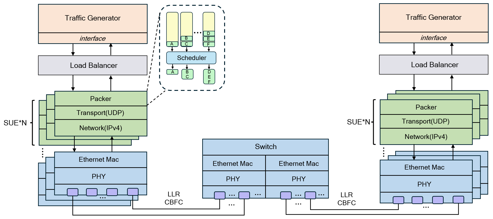
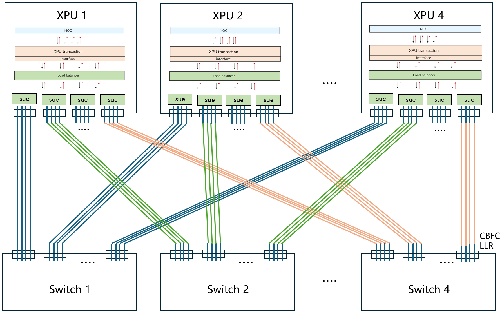

<div align="center">

## **SUE-Sim: End-to-End Scale-Up Ethernet Simulation Platform**

---

</div>

[](https://opensource.org/licenses/Apache-2.0)
[](https://www.nsnam.org/)
[]()
[]()
[](https://www.python.org/)


</div>

## Table of Contents

- [SUE-Sim Overview](#sue-sim-overview)
- [System Architecture](#system-architecture)
  - [Core Components](#core-components)
- [Repository Structure](#repository-structure)
- [Getting Started](#getting-started)
  - [Environment Requirements](#environment-requirements)
  - [Installation](#installation)
  - [Usage](#usage)
- [Configuration Parameters](#configuration-parameters)
---


## SUE-Sim Overview

SUE-Sim is an end-to-end, high-precision network simulation platform for the [Scale-Up Ethernet framework(SUE)](https://docs.broadcom.com/docs/scale-up-ethernet-framework).

Broadcom's SUE provides a low-latency, high-bandwidth interconnect framework for Ethernet-based XPU scale-up networks, supporting efficient interconnection of large-scale XPU clusters at rack-level and even multi-rack-level. It aims to address the increasingly prominent network bottleneck issues caused by the growing complexity of AI and machine learning workloads.

SUE-Sim serves two primary objectives:

- **Network Configuration and Performance Evaluation**: SUE-Sim provides a Scale-Up Ethernet simulation platform for GPU manufacturers, AI computing center operators, and other users. It supports constructing topologies of various scales, configuring parameters, and evaluating network performance under different workloads.

- **SUE Framework Specification Optimization**: The platform enables researchers to optimize SUE framework specifications through advanceing algorithms and protocol validating. 

**Current Version**: SUE-Sim v2.0 🎉

### ✨ What's New in v2.0

- **Module Decoupling**: Decoupled various modules for better maintainability and extensibility
- **Enhanced Traffic Generation**: Added Trace-based and Configuration-based traffic generation methods
- **Event-Driven Logging**: Transformed logging statistics from fixed-time intervals to event-driven triggers
- **Code Optimization**: Optimized code logic for improved performance and readability
- **Bug Fixes**: Resolved critical issues and improved overall stability 

## System Architecture
<p align="center">
  
</p>


### Core Components

- **Traffic Generator**
  - Continuously generates transactions according to configured data rates
- **Load Balancer**
  - Balances traffic across SUE instances
- **Credit-Based Flow Control Module (CBFC)**
  - Maintains credit usage for each VC to control flow
- **SUE Instance Packer**
  - Opportunistically packs transactions up to preconfigured size limits
  - Schedules destination queues to send transactions
- **Link-Level Retransmission Module (LLR)**
  - Retransmits corrupted packets between peer devices
- **Switch**
  - Implements a basic Layer 2 switch, supporting MAC address table lookup and frame forwarding


## Repository Structure

```
SUE-Sim/
├── scratch/                        # Simulation scripts
│   └── SUE-Sim/                    # Main simulation script and configurations
│       ├── SUE-Sim.cc              # Entry point for SUE simulation
│       ├── config/                 # Simulation configuration files
│       │   └── test-fine-grained-config.csv  # Fine-grained test configuration
│       └── trace/                            # Traffic trace files
│           └── all_trace_entries.csv         # Complete traffic trace data
│
├── src/                              # ns-3 source code
│   └── sue-sim-module/               # SUE module
│       ├── model/                    # Core models
│       │   ├── simulation-config/                      # Simulation framework
│       │   │   ├── application-deployer.cc/.h          # Application deployment
│       │   │   ├── common-utils.cc/.h                  # Common utility functions
│       │   │   ├── parameter-config.cc/.h              # Configuration parameters
│       │   │   └── topology-builder.cc/.h              # Network topology builder
│       │   ├── point-to-point-sue-net-device.cc/.h     # Net device core
│       │   ├── point-to-point-sue-channel.cc/.h        # P2P channel
│       │   ├── sue-cbfc.cc/.h                          # Credit-based flow control
│       │   ├── sue-cbfc-header.cc/.h                   # CBFC header
│       │   ├── sue-header.cc/.h                        # SUE header
│       │   ├── sue-llr.cc/.h                           # Link-level retransmission
│       │   ├── sue-client.cc/.h                        # Multi-port client
│       │   ├── sue-server.cc/.h                        # Unpack server
│       │   ├── sue-switch.cc/.h                        # Basic Layer 2 switch
│       │   ├── sue-queue-manager.cc/.h                 # Queue management system
│       │   ├── performance-logger.cc/.h                # Performance logger
│       │   ├── traffic-generator.cc/.h                 # Traffic generator
│       │   ├── traffic-generator-config.cc/.h          # Traffic generator configuration
│       │   ├── traffic-generator-trace.cc/.h           # Trace-based traffic generator
│       │   ├── load-balancer.cc/.h                     # Load balancer
│       │   ├── sue-tag.cc/.h                           # SUE timestamp and PPP sequence tag
│       │   ├── sue-ppp-header.cc/.h                    # PPP header
│       │   └── sue-utils.cc/.h                         # SUE utility functions
│       ├── helper/                  # Helper classes
│       │   └── sue-sim-module-helper.cc/.h
│       └── CMakeLists.txt           # Build configuration
│
├── performance-data/                  # Performance analysis results

├── log/                              # Simulation logs

└── README.md                         # Project documentation
```

### ns-3 Version Support

**🔄 SUE-Sim supports multiple ns-3 versions**

- **ns-3 v3.44**  - `main` branch
- **ns-3 v3.36**  - `ns3-36` branch

## Getting Started

### Environment Requirements

- **Operating System**: Linux (Ubuntu 20.04.6 LTS)
- **Compilers**:
  - **GCC**: 10.1.0+
  - **Clang**: 11.0.0+
  - **AppleClang**: 13.1.6+ (macOS)
- **Build Tools**:
  - **CMake**: 3.13.0+ (Required)

### Installation

#### Step 1: Install System Dependencies
First, install the essential build tools and libraries:

```bash
sudo apt update
sudo apt install build-essential cmake git software-properties-common
```

#### Step 2: Check and Upgrade GCC Version
Check your current GCC version:

```bash
gcc --version
```

**If your GCC version is 10.1.0 or higher**, proceed to [Step 3](#step-3-clone-and-configure-sue-sim).

**If your GCC version is below 10.1.0** (Ubuntu 20.04 default is 9.3.0), upgrade it:

```bash
# Add Ubuntu Toolchain PPA for newer GCC versions
sudo add-apt-repository ppa:ubuntu-toolchain-r/test
sudo apt update
# Install GCC 10 and G++ 10
sudo apt install gcc-10 g++-10
# Set GCC 10 as the default compiler
sudo update-alternatives --install /usr/bin/gcc gcc /usr/bin/gcc-10 100
sudo update-alternatives --install /usr/bin/g++ g++ /usr/bin/g++-10
```

#### Step 3: Clone and Configure SUE-Sim

> **Important Note**: [This version of ns3 does not allow direct execution as root user](https://groups.google.com/g/ns-3-users/c/xDtfcaUrCwg?pli=1), please run the following commands as a regular user.

```bash
# Clone the project
git clone https://github.com/kaima2022/SUE-Sim.git
cd SUE-Sim

# Configure ns-3 environment
./ns3 configure --enable-examples --enable-tests
```

#### Step 4: Build and Verify
```bash
# Build the project
./ns3 build

# Verify installation
./ns3 run "scratch/SUE-Sim/SUE-Sim --help"
```

### Usage

SUE-Sim supports three traffic modes: Uniform Traffic, Trace-based Traffic, and Configuration-based Traffic.
The following command demonstrates a 4-node XPU test scenario:

#### Topology Composition
- **XPU Nodes**: 4 XPUs, each XPU contains 16 ports
- **SUE Units**: Each SUE manages 4 ports

<p align="center">
  
</p>

#### 1. Uniform Traffic Mode
Generates uniform traffic patterns across all nodes:
```bash
./ns3 run "scratch/SUE-Sim/SUE-Sim --nXpus=4 --portsPerXpu=16 --portsPerSue=4 --threadRate=3500000 --totalBytesToSend=5" > log/sue-sim.log 2>&1
```

#### 2. Trace-based Traffic Mode
Uses real traffic traces for realistic simulation:
```bash
./ns3 run "scratch/SUE-Sim/SUE-Sim --nXpus=4 --portsPerXpu=4 --portsPerSue=1 --enableTraceMode=true --traceFilePath=scratch/SUE-Sim/trace/all_trace_entries.csv" > log/sue-sim.log 2>&1
```

#### 3. Configuration-based Traffic Mode
Uses detailed configuration files for custom traffic patterns:
```bash
./ns3 run "scratch/SUE-Sim/SUE-Sim --nXpus=4 --portsPerXpu=4 --portsPerSue=1 --enableFineGrainedMode=true --fineGrainedConfigFile=scratch/SUE-Sim/config/test-fine-grained-config.csv" > log/sue-sim.log 2>&1
```

**Note**: NS3 logging is disabled by default. Performance data is automatically saved to `performance-data/data`. 


## Configuration Parameters

SUE-Sim supports configuration parameters, covering network topology, traffic generation, link layer, CBFC flow control, and other aspects. For complete parameter descriptions, please refer to:

📋 **[Detailed Configuration Parameters Documentation](configuration.md)**

## Contributing

Contributions are welcome! Please feel free to submit a Pull Request. For major changes, please open an issue first to discuss what you would like to change.

## Contact us

For questions, suggestions, or bug reports, please feel free to contact us:

- **Kai Ma**: chasermakai@gmail.com
- **GitHub Issues**: [Submit an issue](https://github.com/kaima2022/SUE-Sim/issues)

We look forward to hearing from you and appreciate your feedback!


## Citation

If you find this project useful for your research, please consider citing it in the following format:

```bibtex
@software{SUESimulator,
  month = {10},
  title = {{SUE-Sim: End-to-End Scale-Up Ethernet Simulation Platform}},
  url = {https://github.com/kaima2022/SUE-Sim},
  version = {1.0.0},
  year = {2025}
}
```

---

<div align="center">

If you find this project helpful, please consider giving it a ⭐ star! Your support is greatly appreciated.

Made by the SUE-Sim Project Team

</div>
