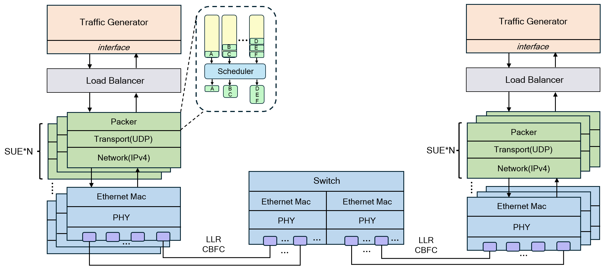

# SUE-Sim

End-to-End Scale-Up Ethernet Simulation Platform based on ns-3.

[](LICENSE)
[](VERSION)
[](README.md#environment-requirements)
[](https://isocpp.org/)

[GitHub Repository](https://github.com/kaima2022/SUE-Sim) | [README](README.md)

SUE-Sim is a Scale-Up Ethernet simulator for AI/HPC data center network research, protocol validation, and performance benchmarking.

## Highlights

- End-to-end simulation for Scale-Up Ethernet protocol workflows.
- Built on ns-3 with reproducible experiment workflows.
- Supports topology construction, parameter tuning, and workload evaluation.
- Targets AI and HPC network scenarios.

## Architecture



## Quick Start

```bash
git clone https://github.com/kaima2022/SUE-Sim.git
cd SUE-Sim
./ns3 configure
./ns3 build
```

For full setup and usage details, see [Getting Started in README](README.md#getting-started).

## Documentation

- [Project README](README.md)
- [Configuration Parameters](configuration.md)
- [Examples](examples/README.md)
