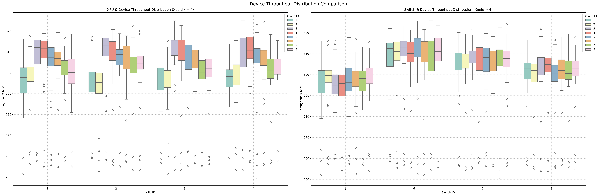
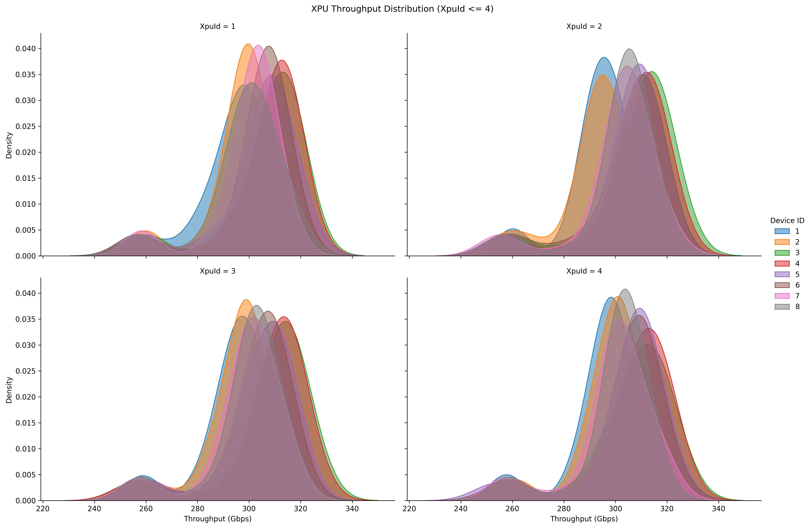
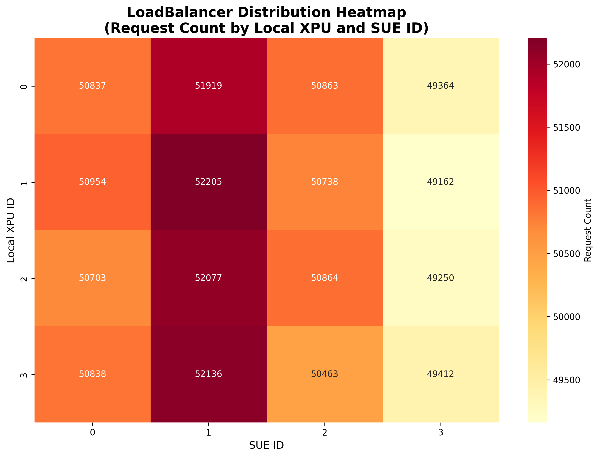
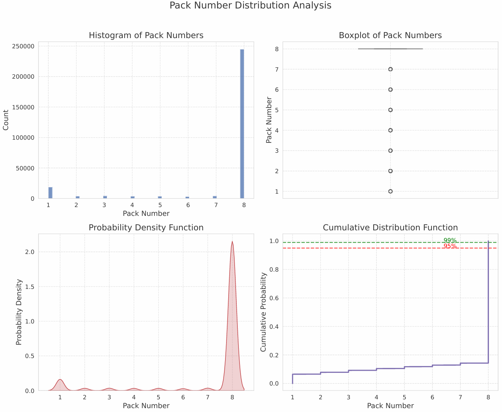
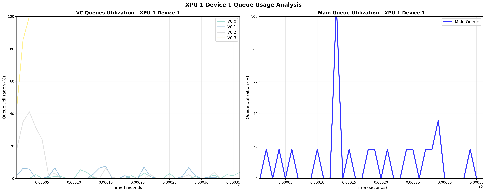
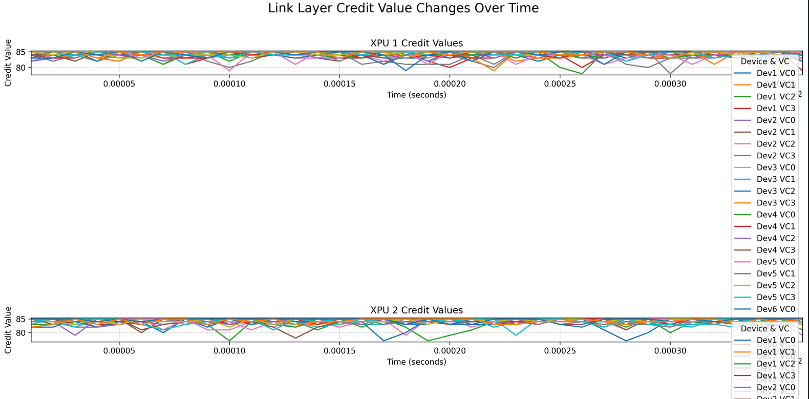

<div align="center">

#  **SUE-Sim Performance Analysis Platform**

### *End-to-End High-Precision Network Simulation Data Analysis & Visualization*

---

</div>

## Platform Overview

This platform is specifically designed for performance analysis of the SUE (Scale-Up Ethernet) framework in ns-3 network simulator, providing data collection, processing, analysis, and visualization capabilities. As a core component of SUE-Sim, this platform offers performance evaluation tools for researchers and developers.

## Directory Structure

```
performance-data/
├── README.md
├── scripts/                         # Analysis scripts
│   ├── performance_metrics_analyzer.py  # Performance metrics
│   ├── network_visualizer.py            # Network visualization
│   ├── loss_analyzer.py                 # Loss analysis
│   ├── load_balance_analyzer.py         # Load balancing
│   ├── queue_usage_analyzer.py          # Queue usage
│   ├── sue_buffer_queue_analyzer.py     # Buffer queue
│   ├── xpu_delay_analyzer.py            # XPU delay
│   └── credit_analyzer.py               # Credit analysis
├── run_*.sh                          # Shell scripts
│   ├── run_analysis.sh                   # Full analysis
│   ├── run_performance_metrics.sh        # Performance metrics
│   ├── run_network_visualizer.sh         # Network visualization
│   ├── run_loss_analyzer.sh              # Loss analysis
│   ├── run_load_balance_analysis.sh      # Load balancing
│   ├── run_queue_usage_analysis.sh       # Queue usage
│   ├── run_sue_monitoring_analysis.sh    # SUE monitoring
│   ├── run_xpu_delay_analysis.sh         # XPU delay
│   ├── run_credit_analysis.sh            # Credit analysis
│   └── run_realtime_monitor.sh           # Realtime monitor
├── docs/
├── data/
│   ├── performance_logs/
│   ├── wait_time_logs/
│   ├── pack_num_logs/
│   ├── load_balance_logs/
│   ├── destination_queue_logs/
│   ├── device_queue_logs/
│   ├── processing_queue_logs/
│   ├── sue_buffer_queue_logs/
│   ├── xpu_delay_logs/
│   ├── link_credit_logs/
│   └── legacy/
├── results/
│   ├── performance_metrics/
│   ├── network_visualizations/
│   ├── loss_analysis/
│   ├── load_balance_analysis/
│   ├── credit_analysis/
│   ├── queue_usage/
│   ├── sue_buffer_queue_analysis/
│   └── xpu_delay_analysis/
└── config/
    └── project_info.py
```

## Quick Start

### 1. Environment Requirements

- Python 3.6+

Install Python 3 and pip3:
  ```bash
  sudo apt update
  sudo apt install python3 python3-pip
  ```

- Required Python packages:
  ```bash
  pip3 install numpy==1.24.4 pandas==2.0.3 matplotlib==3.7.5 seaborn==0.13.2 scipy==1.10.1
  ```

### 2. Running Analysis Scripts

#### Method 1: Using Convenience Scripts (Recommended)

**One-click launch all analyses**:
```bash
# Comprehensive performance analysis 
./performance-data/run_analysis.sh
```

**Specialized analysis scripts**:
```bash
# Performance metrics analysis
./performance-data/run_performance_metrics.sh

# Network visualization analysis (automatically selects latest file)
./performance-data/run_network_visualizer.sh
# Or specify file
./performance-data/run_network_visualizer.sh <performance_log_file>

# Loss analysis (automatically selects default log file)
./performance-data/run_loss_analyzer.sh
# Or specify file
./performance-data/run_loss_analyzer.sh <log_file>

# Load balancing analysis (requires LoadBalancer data)
./performance-data/run_load_balance_analysis.sh

# Queue usage analysis (simplified version, three core charts)
./performance-data/run_queue_usage_analysis.sh

# SUE LoadBalancer monitoring analysis (requires EnableClientCBFC=true)
./performance-data/run_sue_monitoring_analysis.sh

# XPU delay analysis (requires XPU delay recording enabled)
./performance-data/run_xpu_delay_analysis.sh

# Link layer credit analysis (requires credit recording enabled)
./performance-data/run_credit_analysis.sh

# Real-time queue monitoring (requires queue usage data)
./performance-data/run_realtime_monitor.sh
```

#### Method 2: Direct Script Execution

```bash
# Performance metrics analysis
cd scripts && python3 performance_metrics_analyzer.py

# Network visualization analysis (automatically selects latest file)
cd scripts && python3 network_visualizer.py
# Or specify file
cd scripts && python3 network_visualizer.py --Name <performance_file> --xpu_count 4

# Loss analysis (automatically selects default log file)
cd scripts && python3 loss_analyzer.py
# Or specify file
cd scripts && python3 loss_analyzer.py <log_file>

# Load balancing analysis (requires LoadBalancer data)
cd scripts && python3 load_balance_analyzer.py

# Queue usage analysis (simplified version)
cd scripts && python3 queue_usage_analyzer.py

# SUE credit monitoring analysis
cd scripts && python3 sue_buffer_queue_analyzer.py

# SUE buffer queue monitoring analysis
cd scripts && python3 sue_buffer_queue_analyzer.py

# XPU delay analysis
cd scripts && python3 xpu_delay_analyzer.py

# Link layer credit analysis
cd scripts && python3 credit_analyzer.py

# Real-time queue monitoring
cd scripts && python3 realtime_queue_monitor.py
```

### 3. Analysis Features Overview

#### Complete Analysis Platform (`run_analysis.sh`)
- **Launch**: `./run_analysis.sh`
- **Function**: One-click launch of all analysis features
- **Output**:
  - `results/performance_metrics/YYYYMMDD_HHMMSS/`
  - `results/network_visualizations/YYYYMMDD_HHMMSS/`
  - `results/loss_analysis/YYYYMMDD_HHMMSS/`

#### Performance Metrics Analysis (`performance_metrics_analyzer.py`)
- **Input**: `data/packing_logs/wait_time.csv`, `data/packing_logs/pack_num.csv`
- **Output**: `results/performance_metrics/YYYYMMDD_HHMMSS/`
- **Function**: Delay analysis, packet analysis, XPU comparison analysis
- **Charts**: Delay distribution plots, packet distribution plots, XPU comparison plots

#### Load Balancing Analysis (`load_balance_analyzer.py`)
- **Input**: `data/packing_logs/load_balance.csv`
- **Output**: `results/load_balance_analysis/YYYYMMDD_HHMMSS/`
- **Function**: Load balancing effect analysis, fairness evaluation
- **Charts**: Box plots, heatmaps, fairness analysis plots
- **Report**: Detailed load balancing analysis report including CV, RSD, Max/Min ratio metrics

#### Network Visualization Analysis (`network_visualizer.py`)
- **Input**: `data/performance_logs/performance*.csv` (automatically selects latest file)
- **Output**: `results/network_visualizations/YYYYMMDD_HHMMSS/`
- **Function**: Throughput analysis, loss event analysis
- **Charts**: Device throughput plots, loss analysis plots
- **Features**: Default xpu_count=4

#### Loss Analysis (`loss_analyzer.py`)
- **Input**: Simulation log files (default uses `../log/sue-sim.log` or latest .log file)
- **Output**: `results/loss_analysis/YYYYMMDD_HHMMSS/`
- **Function**: Network transmission loss rate, receiver loss rate, total system loss rate calculation
- **Report**: Detailed analysis report, statistical data

#### Queue Usage Analysis (`queue_usage_analyzer.py`)
- **Input**: `data/packing_logs/destination_queue_usage.csv`, `data/packing_logs/device_queue_usage.csv`
- **Output**: `results/queue_usage/YYYYMMDD_HHMMSS/`
- **Function**: XPU and switch queue usage analysis
- **Charts**: Three core charts
  - XPU destination queue usage plot
  - XPU device queue usage plot (main queue + VC queues)
  - Switch device queue usage plot (main queue + VC queues)

#### SUE Buffer Queue Monitoring Analysis (`sue_buffer_queue_analyzer.py`)
- **Input**: `data/packing_logs/sue_buffer_queue.csv`
- **Output**: `results/sue_buffer_queue_analysis/YYYYMMDD_HHMMSS/`
- **Function**: LoadBalancer SUE credit value real-time monitoring analysis
- **Charts**:
  - SUE credit value time series plot (XPU 1)
  - SUE credit value utilization analysis plot (time series + distribution)
- **Report**: Detailed statistical analysis, CSV data export
- **Features**:
  - Default analyzes credit value changes for XPU 1
  - Credit value utilization analysis and distribution statistics
  - Supports multi-SUE parallel monitoring
- **Prerequisites**: Simulation requires `EnableClientCBFC=true`

#### XPU Delay Analysis (`xpu_delay_analyzer.py`)
- **Input**: `data/xpu_delay_logs/xpu_delay_*.csv`
- **Output**: `results/xpu_delay_analysis/YYYYMMDD_HHMMSS/`
- **Function**: XPU end-to-end delay statistical analysis
- **Charts**:
  - Delay overview plot (histogram, box plot, PDF, CDF)
  - XPU-port delay heatmap
  - Tail delay analysis plot (percentile curves + distribution plot)
- **Statistical Features**:
  - Overall delay statistics (mean, median, 95th, 99th, 99.9th, 99.99th percentiles)
  - Delay statistics grouped by XPU ID
  - Variance, skewness, kurtosis analysis

#### Link Layer Credit Analysis (`credit_analyzer.py`)
- **Input**: `data/link_credit_logs/link_credit_*.csv` (independent credit files) or `data/performance_logs/performance*.csv` (backward compatibility)
- **Output**: `results/credit_analysis/YYYYMMDD_HHMMSS/`
- **Function**: Link layer credit value change analysis and statistical reports
- **Charts**:
  - XPU credit value time series change plots (grouped by device and VC)
  - Switch credit value change plots (grouped by target device and VC)
- **Statistical Features**:
  - XPU and switch credit value statistics (min, max, mean, standard deviation)
  - Detailed credit statistics grouped by device and VC

#### Real-time Queue Monitoring (`run_realtime_monitor.sh`)
- **Input**: `data/packing_logs/destination_queue_usage.csv`, `data/packing_logs/device_queue_usage.csv`
- **Function**: Real-time queue usage monitoring
- **Features**:
  - Real-time display of destination queue usage
  - Real-time display of device main queue usage
  - Default update interval: 1000ms
  - Press Ctrl+C to stop monitoring
- **Prerequisites**: Requires queue usage data files

### Automation Features

Each script will:
- Automatically create required directories
- Check input file validity
- Generate timestamped folders
- Provide detailed progress information
- Generate structured output results

## Experimental Results Display

**The following are some experimental result displays from the SUE-Sim platform. Note that the test results are not for reference; it is recommended to adjust parameters according to actual requirements.**

### Throughput Analysis

#### XPU Throughput (Unidirectional)
<p align="center">
  
</p>

#### Box Plot Throughput (Unidirectional)
<p align="center">
  
</p>

#### XPU Node Throughput Distribution (Bidirectional)
<p align="center">
  
</p>

### Load Balancing and Traffic Analysis

#### Load Balancing Heatmap
<p align="center">
  
</p>

### Packing Analysis

#### Packing Number Analysis
<p align="center">
  
</p>

### Queue Management Analysis
#### XPU VC Queue Utilization
<p align="center">
  
</p>

### Credit Flow Control Analysis

#### Credit Value Changes
<p align="center">
  
</p>

> **For more display images**: Check the `../images/DisplayDiagram/` directory for complete platform functionality charts.
>
> **Performance evaluation information**: Check the `results/` directory after running SUE-Sim for more detailed performance evaluation analysis results.
>
> **Research recommendation**: It is recommended to conduct sufficient parameter calibration, comparative validation, and theoretical analysis in research to ensure the scientific nature and reliability of research conclusions.

---

<div align="center">


Made by SUE-Sim Project Team

</div>
